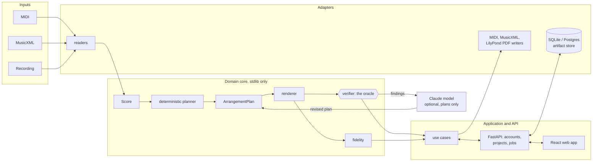

# Arranger

[](https://github.com/aleenabenny0/arranger/actions/workflows/ci.yml)
[](https://github.com/aleenabenny0/arranger/blob/main/pyproject.toml)
[](#license)

Music in, playable-for-you sheet music out.

**Live demo:** _coming soon_ · **Walkthrough:** _GIF coming soon_

<!-- Replace the two placeholders above with the deployed URL and a recorded walkthrough. -->

## Quickstart

Bash (Git Bash on Windows, or Linux and macOS):

```bash
scripts/setup.sh            # venv, dependencies, notation engine, the web app build; add --audio or --e2e
scripts/test.sh             # the suite as CI runs it: Python, then the web app's type check and unit tests
.venv/bin/arranger-api      # http://127.0.0.1:8000 (.venv/Scripts/arranger-api in Git Bash)
```

PowerShell (Node 22 is needed for the web app):

```powershell
py -m venv .venv
.venv\Scripts\python -m pip install -e ".[api,dev]"
.venv\Scripts\python fetch_vendor.py
npm --prefix frontend-react ci
npm --prefix frontend-react run build       # writes frontend-react\dist, which the API serves at /
.venv\Scripts\python -m pytest -q
.venv\Scripts\arranger-api                  # http://127.0.0.1:8000
```

## How it fits together



The model never writes notes. It emits an `ArrangementPlan`; the renderer turns
the plan into a score; the dependency-free verifier decides whether that score
fits one specific pair of hands. See `docs/architecture.md`.

You have a MIDI file, a MusicXML score or a recording of a song — a full-band arrangement, an orchestral
reduction, whatever you could find — and you want to play it on piano. It
isn't written for your instrument, or it's three grades above you, or it just
doesn't fit your hands. Arranger reduces it to two hands, arranges it for
*your* level, and verifies the result is physically playable before you ever
see it.

It runs as a web app: upload, check what was read, describe your hands, arrange,
read and hear the result with anything outside your limits marked, revise, and
download MIDI, MusicXML and a printable PDF. Your pieces and every revision are
saved to your account.

## The interesting part

Playability is not a matter of opinion. Whether a chord fits under a hand,
whether a leap is possible in the time available, whether a passage needs more
fingers than you have — these are constraints, and constraints can be checked
by a machine.

So the LLM never writes notation. It emits an **arrangement plan** — what to
keep, how to voice it, what the left hand does — and a deterministic renderer
turns that into a score. A dependency-free verifier then checks the result
against a physical model of one specific player and returns a structured
verdict. Failures go back to the agent as numbers it can act on, not prose it
has to interpret.

The model does judgement. Code does correctness.

Before the model edits anything, a deterministic planner now creates the first
draft from bar-level musical features. That draft is rendered, verified, scored
for fidelity, and passed into the model loop as the starting point for repair.

## Run the app

```powershell
py -m venv .venv
.venv\Scripts\python -m pip install -e ".[api,dev]"
.venv\Scripts\python fetch_vendor.py        # the notation engine, checksum-verified
.venv\Scripts\arranger-api                  # http://127.0.0.1:8000
```

That is the whole product with MIDI and MusicXML in, and MIDI and MusicXML out.
Arranging needs no API key: the deterministic engine does it. Three things are
optional, and the app says plainly when one is missing:

| For | Install |
|---|---|
| Printable PDF | LilyPond 2.24 on `PATH`, or `LILYPOND_PATH` |
| Recordings as input | `pip install numpy onnxruntime soundfile soxr`, then `pip install --no-deps basic-pitch` |
| A model that tries to improve the arrangement | `pip install -e ".[model]"`, `ANTHROPIC_API_KEY`, `MODEL_REPAIR_ENABLED=true` |

Tests: `python -m pytest -q`. Browser tests need `pip install -e ".[e2e]"`,
`python fetch_vendor.py --dev`, and Edge, Chrome or `playwright install chromium`.
Deployment is in `docs/deployment.md`.

The same run CI does, with coverage (the build fails under the `fail_under`
gate in `pyproject.toml`), a JUnit file, the slowest tests and up to two reruns
of a failing test, followed by the quality table CI puts in its job summary:

```powershell
.venv\Scripts\python -m pytest --cov=src --cov-report=term --cov-report=xml:reports/coverage.xml --junitxml=reports/junit.xml --durations=10 --reruns 2 -rRs --ignore=tests/test_browser_e2e.py
.venv\Scripts\python scripts\test_report.py --junit reports\junit.xml --coverage reports\coverage.xml
```

```bash
python -m pytest --cov=src --cov-report=term --cov-report=xml:reports/coverage.xml --junitxml=reports/junit.xml --durations=10 --reruns 2 -rRs --ignore=tests/test_browser_e2e.py
python scripts/test_report.py --junit reports/junit.xml --coverage reports/coverage.xml
```

A test that passes only after a rerun is listed as flaky in that table; it is
a bug to fix, not a pass.

## Testing strategy

Every layer has its own tests, and CI runs all of them on every push:

| Layer | What it proves | Where |
|---|---|---|
| Unit | The verifier, solver, planner, renderer, fidelity scorer, notation and file adapters, each against small scores built in the test | `tests/test_constraints.py` (also run on bare stdlib), `test_solver.py`, `test_engine.py`, `test_planner.py`, `test_render.py`, `test_fidelity.py`, `test_notation.py`, `test_midi_io.py`, `test_musicxml_reader.py`, `test_audio_transcription.py` |
| Web app | Every React component and view, and the typed API client's error paths, under jsdom against a `fetch` stand-in; the TypeScript build itself, typed from the API's OpenAPI document | `frontend-react/src/**/*.test.tsx` (Vitest + Testing Library, 81 tests), `npm run typecheck` |
| API | Every route over HTTP with the real app: auth, CSRF, rate limits, ownership, quotas, jobs, exports | `tests/test_api*.py`, `test_workflows.py`, `test_artifacts.py` |
| Database | Repositories on SQLite and, in CI, on real Postgres; failure injection proves every multi-write path is atomic | `tests/test_storage.py`, `test_transactions.py`, `test_postgres_integration.py` |
| End to end | A real browser drives the product. The Node suite: auth, upload, profile, plan authoring, verify, export, view switching, axe scans, API checks. The Python suite: the deeper journey with email verification, playback, PDF and keyboard-only use at phone width | `e2e/` (`@playwright/test`, 15 tests), `tests/test_browser_e2e.py` |
| Security | Bandit on the source, pip-audit on the lock file, Gitleaks on the history, an OWASP ZAP baseline scan of the built image, Snyk when a token is configured | the `security` and Docker CI jobs, `.zap/rules.tsv`, `docs/security.md` |
| Smoke | The built image starts, answers `/health` and `/ready`, and a throwaway account can register, sign in, list profiles and sign out | `scripts/smoke.sh` in the Docker CI job |

The suite runs with coverage (gated by `fail_under` in `pyproject.toml`), a
JUnit report and reruns that expose flaky tests; the CI job summary shows the
counts, pass rate, coverage, slowest tests and any flaky test.

## Scripts

Bash scripts for the three routine jobs, written for Git Bash on Windows and
for bash on Linux and macOS (CI lints them with ShellCheck). PowerShell users
have the equivalents next to each.

| Job | Bash | PowerShell |
|---|---|---|
| Set up a machine | `scripts/setup.sh` (`--audio`, `--e2e`; builds the web app when `npm` is installed) | the block under "Quickstart" |
| Test like CI | `scripts/test.sh` (`--quick`, `--browser`, `--no-web`, `-- <pytest args>`) | `python -m pytest` and `npm --prefix frontend-react test` |
| Smoke-test a running server | `scripts/smoke.sh http://127.0.0.1:8000` | the snippet below |

`smoke.sh` checks `/health` and `/ready`, that `/auth/me` is 401 without a
session, then registers a throwaway account, signs in with a cookie jar and the
CSRF header, lists profiles and signs out. It prints one `ok`/`FAIL` line per
check and exits non-zero on any failure. `SMOKE_CAPABILITIES=export_pdf,import_audio`
also checks `/catalog`; CI runs it that way against the freshly built image.

```powershell
$base = "http://127.0.0.1:8000"
(Invoke-WebRequest "$base/health").StatusCode
(Invoke-WebRequest "$base/ready").StatusCode
$session = New-Object Microsoft.PowerShell.Commands.WebRequestSession
$body = @{ email = "smoke-$(Get-Random)@example.com"; password = "smoke-passphrase-$(Get-Random)"; display_name = "Smoke" } | ConvertTo-Json
Invoke-RestMethod "$base/auth/register" -Method Post -ContentType "application/json" -Headers @{ Origin = $base } -Body $body -WebSession $session
$csrf = ($session.Cookies.GetCookies($base) | Where-Object Name -eq "arranger_csrf").Value
Invoke-RestMethod "$base/profiles" -WebSession $session
Invoke-RestMethod "$base/auth/logout" -Method Post -Headers @{ Origin = $base; "X-CSRF-Token" = $csrf } -WebSession $session
```

## Try the verifier alone

```bash
git clone <your-repo> && cd arranger
PYTHONPATH=src python3 tests/test_constraints.py
PYTHONPATH=src python3 -m arranger.verify.cli \
    tests/fixtures/too_hard.json --profile profiles/me.json
```

```
NOT PLAYABLE  —  4 hard, 0 strain
  [bar 1] LH must span 19 semitones (C2-G3); max is 12. Drop an inner voice
          or move one pitch an octave.
  [bar 3] LH must move 27 semitones in 50ms; feasible budget is 9. Sustain
          the lower note with pedal, or re-voice so the hand stays put.
  [bar 3] D8 is outside the playable range A0-C8
```

No dependencies required for the above. That's deliberate — see `CLAUDE.md`.

## Your hands, in a file

`profiles/me.json` is the physical model. Every number is measurable at a
piano in under a minute:

```json
{ "max_span": 12, "comfortable_span": 9, "max_leap_rate": 70.0, "skill_level": 5 }
```

`max_span` is the widest block chord you can hold. `max_leap_rate` is how fast
your hand relocates, in semitones per second — play a two-octave leap cleanly
and time it. Change these and the same piece becomes playable or doesn't.

## Status

- [x] **M1** Playability verifier + profile model (zero dependencies)
- [x] **M2** MIDI and MusicXML in; MIDI, MusicXML and engraved PDF out
- [x] **M3** Global hand solver: phrase-based search with FEASIBLE / INFEASIBLE /
  UNKNOWN, pedal, rolled chords and crossing. Dynamic programming in the
  standard library, not CP-SAT; per-note fingering is still open
- [x] **M4** Eval harness + baseline, public-domain corpus (`evals/corpus/`, `python fetch_corpus.py`)
- [x] **M5** Deterministic arranging engine, with a bounded model repair loop on top
- [x] **M6** Audio transcription (one instrument, Basic Pitch)
- [x] **M7** Web app: accounts, projects, revisions, background jobs, notation
  preview, playback, downloads, data export and deletion

`docs/progress.md` is the running log. `docs/build-log/limitations.md` says what
is knowingly wrong.

## Open question: does the agent beat brute force?

`arranger.agent.arrange` is supposed to earn its cost against
`brute_force_baseline` — an exhaustive search over 54 fixed plans with no
model involved (see `arranger.agent`'s own docstring). Testing that claim
turned into real work of its own, tracked in `SCORECARD.md` rather than
here. Short version:

- **Established:** the 20-piece public-domain corpus (`evals/corpus/`)
  can't test this at all — brute force already reaches cost 0.00 on every
  piece in it. What actually resists brute force turned out not to be
  "orchestral" or "multi-instrument" (both tested and falsified against
  real orchestral and chamber scores) but specifically *virtuosic Romantic
  concerto solo writing* — confirmed on 2 composers so far. Full writeup:
  `evals/corpus/README.md`, "Sourcing criteria" section.
- **Open:** a 3-piece verdict-eligible pool now exists and meets the
  pre-registered minimum (`docs/build-log/eval-protocol.md`), but no real
  agent run has happened against it yet — every number so far comes from
  the deterministic baseline search, not from Claude. `SCORECARD.md` has
  the current pool, what's missing before the eval can run
  reproducibly, and the historical (pre-protocol, non-reproducible) numbers
  from `samples/Queen - Bohemian Rhapsody.mid` for context.

## Roadmap

Not built yet:

- **Per-note fingering.** The solver assigns hands and checks that chords fit
  the available fingers. It does not choose or print a finger for each note.
- **Source separation and beat tracking for audio.** One instrument at a time,
  and the user sets tempo and meter. Accuracy has only been measured on
  synthesised audio.
- **Richer notation.** No grace notes, ornaments, slurs, dynamics, repeats,
  lyrics or chord symbols.
- **A note editor.** Corrections are by part, transposition, tempo, meter and
  removing doubtful notes; there is no piano roll.
- **LangGraph orchestration.** The repair loop in `arranger.agent` is a plain
  Python loop calling the Claude API directly, not a LangGraph graph.

Before a public launch: `docs/legal-review.md` (operator identity, consent for
hand measurements, minimum age) and the limitations in `docs/security.md`.

## License

No license has been chosen yet, so the code is all rights reserved by default.
The evaluation corpus is public-domain and Creative Commons material only (see
`evals/corpus/README.md`).

## Design notes

- `docs/architecture.md` — current layers and where future APIs/adapters fit
- `docs/deployment.md` — Docker/Railway hosting setup and cloud environment
- `docs/runbook.md` — backups, restore, rollback, alerts, incidents
- `docs/security.md` — controls, the tests that pin them, and what is missing
- `docs/legal-review.md` — decisions that need the owner or a lawyer
- `docs/algorithm.md` — how melody, harmony, hands and fidelity are computed
- `docs/audio-transcription.md` — how recordings become notes, and how well
- `docs/build-log/why-plans-not-notes.md` — why the model never emits notation
- `docs/build-log/limitations.md` — what's knowingly wrong and what fixes it
- `docs/build-log/eval-protocol.md` — pre-registered design for the "does
  the agent beat brute force" eval, decided before results came back
- `evals/corpus/README.md` — corpus licensing, and what actually resists
  brute force (measured, not guessed)
- `CLAUDE.md` — working rules for agents in this repo
